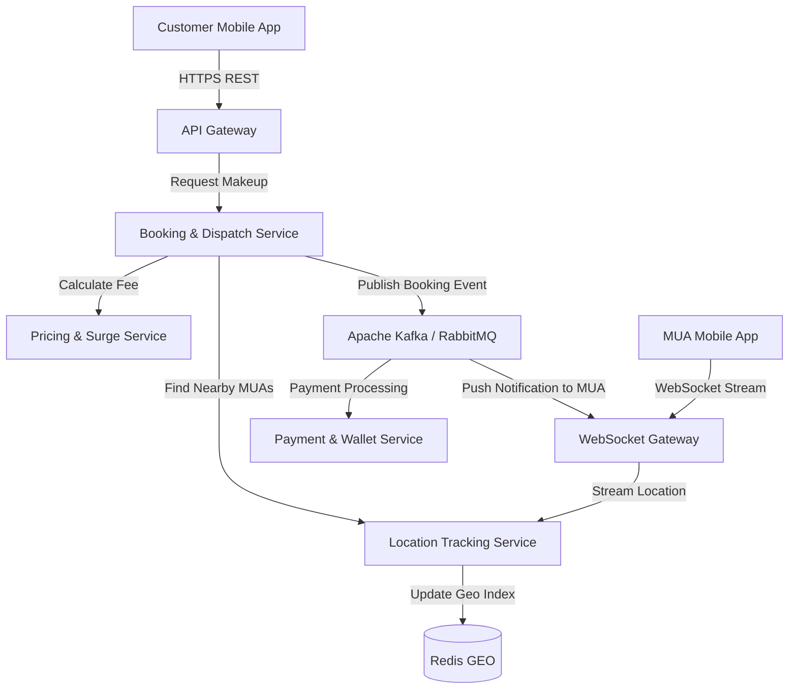

# ĐỀ TÀI: HỆ THỐNG ĐẶT THỢ TRANG ĐIỂM TẬN NƠI THEO THỜI GIAN THỰC (ON-DEMAND MOBILE MAKEUP SYSTEM)

## 1. TỔNG QUAN VỀ ĐỀ TÀI
- **Tên đề tài:** Thiết kế và phát triển hệ thống Đặt Thợ Trang Điểm & Cung Cấp Dịch Vụ tận nơi thời gian thực trên kiến trúc Microservices.
- **Mô tả:** Hệ thống quản lý kết nối giữa Khách hàng (Customer) và Thợ trang điểm (Makeup Artist - MUA), định vị vị trí thời gian thực (Real-time GPS Tracking), tính toán chi phí linh hoạt (Gồm phí di chuyển + Phí dịch vụ makeup) và ghép nối lịch hẹn thông minh (Matching Engine).
- **Tính thực tế doanh nghiệp:**
  - Xử lý tọa độ GPS gửi lên liên tục từ ứng dụng của các thợ trang điểm đang rảnh hoặc đang di chuyển đến nhà khách.
  - Đòi hỏi độ trễ cực thấp trong việc ghép nối thợ makeup gần nhất có chuyên môn phù hợp với yêu cầu khách hàng.
  - Phân tách service giúp đảm bảo nếu hệ thống tính cước bị tải cao, các thợ makeup vẫn cập nhật được vị trí và nhận được điều phối sự kiện (event-driven workflows).

---

## 2. PHÂN TÍCH KIẾN TRÚC MICROSERVICES

### 2.1. Danh sách các Microservices chính
1. **API Gateway & WebSocket Gateway:**
   - Quản lý kết nối HTTP REST và kết nối WebSocket persistent hai chiều với ứng dụng Thợ makeup & Khách hàng.
   - *Công cụ:* Nginx / Envoy / Node.js WebSocket Gateway.
2. **User & MUA Profile Service:**
   - Quản lý tài khoản khách hàng, hồ sơ thợ trang điểm (Portfolio, đánh giá, chứng chỉ), trạng thái hoạt động (Online/Offline/Busy).
   - *Database:* PostgreSQL (hoặc MySQL).
3. **Location & Telemetry Tracking Service (High Throughput Service):**
   - Tiếp nhận stream tọa độ GPS từ ứng dụng thợ makeup gửi lên theo chu kỳ.
   - Lưu trữ và cập nhật vị trí mới nhất của thợ để hỗ trợ truy vấn không gian.
   - *Database:* Redis (Redis GEO Data Structure) + PostGIS.
4. **Booking & Dispatching Matching Service (Core Engine):**
   - Nhận yêu cầu đặt lịch từ khách hàng -> Tìm kiếm thợ makeup phù hợp xung quanh bán kính X km -> Gửi đề nghị nhận ca tới thợ makeup.
   - Quản lý trạng thái lịch hẹn (Requested, Accepted, MUA_On_The_Way, Arrived, In-Progress, Completed, Cancelled).
   - *Database:* MongoDB hoặc PostgreSQL.
5. **Dynamic Pricing & Service Fee Service:**
   - **Công thức tính:** Tổng phí = Phí quãng đường di chuyển (dựa trên GPS/Maps API) + Phí niêm yết của gói dịch vụ trang điểm + Phụ phí (Surge Pricing nếu nhu cầu cao).
   - Tính toán giá tiền di chuyển, thời gian dự kiến và hệ số nhân nhu cầu (Surge Pricing dựa trên mật độ thợ vs khách hàng tại khu vực).
   - *Database:* Redis (Lưu cache quy tắc bảng giá và gói dịch vụ makeup).
6. **Payment & Wallet Service:**
   - Quản lý ví điện tử của thợ makeup, trừ chiết khấu nền tảng, thanh toán qua thẻ/ví điện tử cho khách hàng.
   - *Database:* PostgreSQL.

### 2.2. Sơ đồ kiến trúc & Cơ chế giao tiếp (Inter-Service Communication)
*Sơ đồ trực quan luồng hoạt động tương tự như hình ảnh bạn cung cấp, được vẽ bằng Mermaid:*



- **Truyền nhận dữ liệu thời gian thực (Real-time Streaming):** 
  - Giữ kết nối liên tục giữa MUA App và `Location Service`.
- **Event-Driven Architecture:**
  - Khi khách hàng trang điểm xong -> `Booking Service` bắn event `ServiceCompletedEvent`.
  - `Payment Service` tự động xử lý thanh toán, trừ tiền ví/thẻ của khách và cộng tiền vào ví thợ.

---

## 3. HƯỚNG DẪN TÌM HIỂU VÀ PHÂN TÍCH HỆ THỐNG

### Giai đoạn 1: Phân tích Kỹ thuật Xử lý Dữ liệu Không gian (Spatial Indexing)
1. **Nghiên cứu Redis GEO & H3 Spatial Index:**
   - Học cách sử dụng lệnh `GEOADD`, `GEORADIUS` / `GEOSEARCH` trong Redis để tìm kiếm thợ makeup trong bán kính 2-5km với thời gian phản hồi cực nhanh.
2. **Quản lý trạng thái kết nối WebSocket:**
   - Dùng Redis Pub/Sub để broadcast tin nhắn giữa các instance WebSocket Gateway khi gửi yêu cầu nhận ca cho thợ.

### Giai đoạn 2: Thiết kế Matching Engine & State Machine
1. **Thiết kế Máy trạng thái Lịch hẹn (State Machine):**
   - Vẽ và cài đặt luồng chuyển trạng thái nghiêm ngặt: `CREATED` -> `MATCHING` -> `ACCEPTED` -> `MUA_MOVING` -> `ARRIVED` -> `MAKING_UP` -> `COMPLETED`.
   - Đảm bảo tránh tình trạng 2 khách hàng đặt cùng 1 thợ makeup tại 1 thời điểm (Concurrency Control / Atomic Lock).

### Giai đoạn 3: Phân tích Tính toán cước giá động (Surge Pricing)
1. **Thu thập Metrics:**
   - Đếm số lượng yêu cầu tạo lịch makeup (Demand) vs số lượng thợ make rảnh (Supply) trong cùng một geohash (ô lưới địa lý) theo từng khung giờ.
   - *Lưu ý: Áp dụng hệ số nhân giá (surge multiplier) khi số yêu cầu tăng đột biến so với lượng thợ rảnh trong khu vực.*

---

## 4. HƯỚNG DẪN TRIỂN KHAI LÊN SERVER VPS THỰC TẾ

### Step 1 & 2: Chuẩn bị Hạ tầng & Containerization
- VPS Ubuntu 22.04 LTS.
- Docker Compose khởi chạy các container: `ws-gateway`, `api-gateway`, `booking-service`, `location-service`, `pricing-service`, `payment-service` cùng các Infra (`Redis Geo`, `PostgreSQL`, `Kafka`).

### Step 3: Cấu hình Nginx Reverse Proxy cho WebSocket
```nginx
server {
    server_name makeup-api.yourdomain.com;

    # HTTP REST APIs
    location /api/v1/ {
        proxy_pass http://localhost:8000;
        proxy_set_header Host $host;
    }

    # Real-time WebSocket connection
    location /ws/ {
        proxy_pass http://localhost:8001;
        proxy_http_version 1.1;
        proxy_set_header Upgrade $http_upgrade;
        proxy_set_header Connection "Upgrade";
        proxy_set_header Host $host;
        proxy_read_timeout 86400s; 
    }
}
```

---

## 5. TIÊU CHÍ ĐÁNH GIÁ & YÊU CẦU BÀI LÀM
1. **Tính thời gian thực (Real-time Performance):** Vị trí thợ makeup đang di chuyển đến nhà khách cập nhật liên tục và hiển thị mượt mà trên bản đồ khách hàng qua WebSocket với độ trễ < 500ms.
2. **Khả năng ghép nối (Matching Accuracy):** Hệ thống gửi tín hiệu đặt lịch đến đúng thợ đang rảnh/gần nhất và tính toán đúng: Phí dịch vụ makeup + Phí di chuyển.
3. **Kịch bản Demo & Chịu tải:**
   - Viết script Python / Node.js giả lập 100 thợ makeup di chuyển ảo và gửi tọa độ GPS liên tục.
   - Thực hiện thao tác đặt lịch từ ứng dụng khách hàng thực tế và kiểm tra thợ ảo nhận được thông báo.
